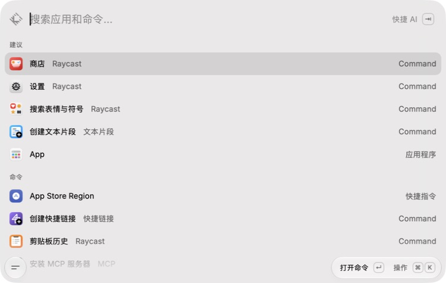
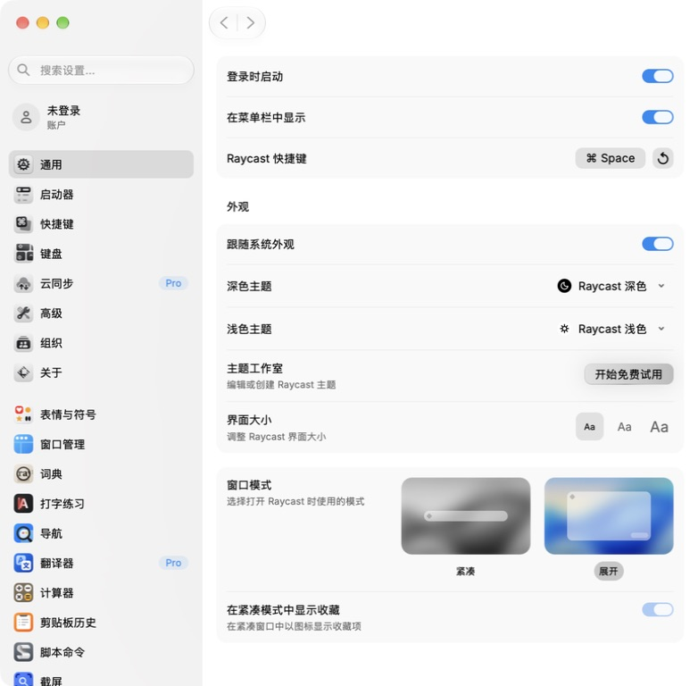
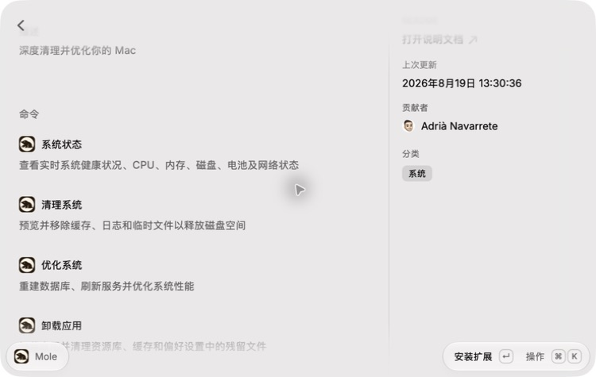

# Raycast 汉化包｜macOS 简体中文补丁

为 macOS 上的 **Raycast 2.4.1.0（Apple Silicon / arm64）** 提供简体中文界面的非官方汉化包。支持主界面、设置、部分提示，以及 36 个选定插件的商店文案和部分内部界面，附带安装与恢复原版工具。

**[下载最新版汉化包](https://github.com/zwjtano/raycast-macos-zh-CN/releases/latest)** · [安装教程](#安装教程) · [恢复原版](#恢复与更新) · [插件列表](#插件汉化列表) · [常见问题](#常见问题)

| 项目 | 支持情况 |
| --- | --- |
| Raycast 版本 | 2.4.1.0，安装时校验文件指纹 |
| 平台 | macOS，Apple Silicon（arm64） |
| 中文语言 | 简体中文（zh-CN） |
| 插件覆盖 | 36 个选定插件，部分界面与商店文案 |
| 原生菜单栏 | 保留英文 |
| 恢复 | 安装前自动备份，提供恢复原版工具 |

本项目提供中文补丁，不包含 Raycast 应用安装程序，也不是官方中文版。

## 汉化效果截图

以下为 Raycast 2.4.1.0 arm64 安装 r4 补丁后的实际界面截图。

### 主界面

### 通用设置

### Mole 插件商店命令

插件截图展示商店文案，不代表插件内部全部功能已完成汉化验收。

## 安装教程

[下载汉化包 ZIP](https://github.com/zwjtano/raycast-macos-zh-CN/releases/download/v2.4.1.0-r4/Raycast-2.4.1.0-arm64-r4.zip) · [SHA-256 校验文件](https://github.com/zwjtano/raycast-macos-zh-CN/releases/download/v2.4.1.0-r4/Raycast-2.4.1.0-arm64-r4.zip.sha256)

在 Release 页的 Assets 中选择上述 ZIP，完整解压。GitHub 自动生成的 Source code 不是安装包；不要单独下载 `.command` 文件。

1. 安装对应官方原版，放到“应用程序”，先成功打开一次，再从菜单完全退出 Raycast。
2. 双击“安装汉化.command”。应用路径直接回车，默认 `/Applications/Raycast.app`。
3. 确认提示处直接回车开始安装；输入 `n` 取消。完成后打开 Raycast。

无须安装 Python、Node 或开发工具。不自动提权。程序版本和文件指纹必须同时匹配，其他版本会拒绝安装。

## 恢复与更新

完全退出 Raycast，双击同一补丁包里的“恢复原版.command”，两次回车即可按默认路径恢复。恢复后会检查完整官方签名。

安装前自动备份原始资源，位置为 `~/Library/Application Support/Raycast-Chinese-Patch/2.4.1.0/`。请保留备份及补丁包，且不要移动打过补丁的应用。

升级 Raycast 前先恢复原版。已有旧版汉化时，应先使用旧包恢复，再安装此包。本包不能跨版本使用；应用更新或被其他工具修改后，恢复工具会拒绝覆盖。

## 覆盖范围

- 主界面、设置、部分操作提示、权限说明与表情名称。
- 36 个选定插件的商店介绍、命令说明、偏好设置及部分内部界面；未安装插件的商店文案也可汉化。
- 应用与插件名称保持原文，主搜索结果右侧类型标签保留 `Command`。
- 菜单栏保留英文，不含原生菜单实验补丁。

191 项替换或新增资源。36 个插件没有逐一完成全部功能验收，未知文案、部分动态内容、README 和部分登录后页面可能保持英文，不宣称完整汉化。不启用未经复核的机翻草稿。

## 插件汉化列表

以下 36 个插件已纳入 r4 的翻译范围：商店介绍、命令名称与说明、偏好设置及部分内部界面。插件名称保留原文，**不代表所有页面、动态内容和功能均已完整汉化或实际验收**。

前 30 项按 2026-09-17 的商店快照选取（下载量至少 100,000），后 6 项为补充适配；下载量不是实时数据。

| 序号 | 插件（商店链接） | 纳入范围 |
| --- | --- | --- |
| 1 | [Kill Process](https://www.raycast.com/rolandleth/kill-process) | 热门插件 |
| 2 | [Color Picker](https://www.raycast.com/thomas/color-picker) | 热门插件 |
| 3 | [Google Chrome](https://www.raycast.com/Codely/google-chrome) | 热门插件 |
| 4 | [Google Translate](https://www.raycast.com/gebeto/translate) | 热门插件 |
| 5 | [Spotify Player](https://www.raycast.com/mattisssa/spotify-player) | 热门插件 |
| 6 | [Visual Studio Code](https://www.raycast.com/thomas/visual-studio-code) | 热门插件 |
| 7 | [Linear](https://www.raycast.com/linear/linear) | 热门插件 |
| 8 | [Slack](https://www.raycast.com/mommertf/slack) | 热门插件 |
| 9 | [Brew](https://www.raycast.com/nhojb/brew) | 热门插件 |
| 10 | [Notion](https://www.raycast.com/notion/notion) | 热门插件 |
| 11 | [ChatGPT](https://www.raycast.com/abielzulio/chatgpt) | 热门插件 |
| 12 | [Arc](https://www.raycast.com/the-browser-company/arc) | 热门插件 |
| 13 | [1Password](https://www.raycast.com/khasbilegt/1password) | 热门插件 |
| 14 | [GitHub](https://www.raycast.com/raycast/github) | 热门插件 |
| 15 | [Speedtest](https://www.raycast.com/tonka3000/speedtest) | 热门插件 |
| 16 | [Obsidian](https://www.raycast.com/marcjulian/obsidian) | 热门插件 |
| 17 | [Apple Notes](https://www.raycast.com/raycast/apple-notes) | 热门插件 |
| 18 | [Google Search](https://www.raycast.com/mblode/google-search) | 热门插件 |
| 19 | [Coffee](https://www.raycast.com/mooxl/coffee) | 热门插件 |
| 20 | [Video Downloader](https://www.raycast.com/vimtor/video-downloader) | 热门插件 |
| 21 | [Timers](https://www.raycast.com/ThatNerd/timers) | 热门插件 |
| 22 | [Apple Reminders](https://www.raycast.com/raycast/apple-reminders) | 热门插件 |
| 23 | [CleanShot X](https://www.raycast.com/Aayush9029/cleanshotx) | 热门插件 |
| 24 | [System Monitor](https://www.raycast.com/hossammourad/raycast-system-monitor) | 热门插件 |
| 25 | [Zoom](https://www.raycast.com/raycast/zoom) | 热门插件 |
| 26 | [Warp](https://www.raycast.com/warpdotdev/warp) | 热门插件 |
| 27 | [Pomodoro](https://www.raycast.com/asubbotin/pomodoro) | 热门插件 |
| 28 | [YouTube](https://www.raycast.com/tonka3000/youtube) | 热门插件 |
| 29 | [Lorem Ipsum](https://www.raycast.com/AntonNiklasson/lorem-ipsum) | 热门插件 |
| 30 | [GIF Search](https://www.raycast.com/josephschmitt/gif-search) | 热门插件 |
| 31 | [Mole](https://www.raycast.com/jlrochin/mole) | 补充适配 |
| 32 | [Dropover](https://www.raycast.com/jag-k/dropover) | 补充适配 |
| 33 | [App Cleaner](https://www.raycast.com/dziad/appcleaner) | 补充适配 |
| 34 | [Amphetamine](https://www.raycast.com/gstvds/amphetamine) | 补充适配 |
| 35 | [TinyPNG](https://www.raycast.com/kawamataryo/tinypng) | 补充适配 |
| 36 | [Music](https://www.raycast.com/fedevitaledev/music) | 补充适配 |

已进行的实际界面核对包括：Google Translate 翻译功能；Mole、Dropover 的商店介绍与命令文案。其余插件尚未逐一完成全部功能的运行验收。

## 启动限制

修改资源会使应用的完整官方签名校验失效，部分机器可能被 macOS 拦截。本机已验证能启动，但不保证其他机器能启动。

补丁不修改原生可执行文件、不重新签名、不移除隔离标记、不关闭系统安全保护，也不修改用户数据库和账户数据。如提示“已损坏”，优先使用恢复工具；若恢复失败，重新安装对应官方原版。不要重置数据库。

## 文件说明

- `安装汉化.command`、`恢复原版.command`：双击操作入口。
- `patch.sh`、`payload/`、`manifest.tsv`、`native-sha256.txt`：安装、校验及还原必需，须整体保留。
- `Unicode-LICENSE.txt`、`Unicode来源.json`、`Acorn-LICENSE.txt`：第三方许可及数据来源。

不包含 Raycast 安装程序、测试应用、个人配置、数据库或备份。

## 常见问题

### Raycast 怎么设置中文？

本项目通过替换指定版本的界面资源实现简体中文显示。请按照上方安装教程操作；它不是通用的语言设置开关。

### 这是 Raycast 官方中文版吗？

不是。这是社区制作的非官方中文补丁，需要自行安装对应官方原版。

### 支持 Intel Mac 或其他 Raycast 版本吗？

本包仅支持 Raycast 2.4.1.0 arm64。Intel 版本和其他版本尚未适配，不要强行安装。

### 插件都完整汉化了吗？

没有。覆盖范围是 36 个选定插件的商店文案及部分内部界面，包括 Mole、Dropover、App Cleaner、Amphetamine、TinyPNG 和 Music 等。未知文字和未覆盖页面保留原文。

### 汉化后提示“已损坏”怎么办？

修改资源可能触发 macOS 的签名检查。优先使用本包的恢复工具还原；恢复失败时重新安装对应官方原版。不要重置用户数据库，也不要关闭全局安全保护。

### Raycast 更新后还能用吗？

本补丁不能跨版本使用。升级前先恢复原版；升级后的汉化需要适配对应版本。

### 如何反馈漏译或安装问题？

通过 [GitHub Issues](https://github.com/zwjtano/raycast-macos-zh-CN/issues) 提供 Raycast 版本、macOS 版本、芯片类型及问题截图。提交前遮住账户信息、密钥和个人内容。

## English overview

An unofficial **Simplified Chinese localization patch for Raycast on macOS**, targeting **Raycast 2.4.1.0 on Apple Silicon (arm64)**. Includes translated UI resources, selected text for 36 extensions, an installer, and a restore tool. Native menus remain English; translation coverage is partial. No Raycast application binary or personal data is included. Resource changes invalidate the complete app signature and may be blocked by macOS. Use only with the matching original version.

## 第三方内容

本项目与 Raycast 官方无隶属关系。Raycast 及其应用资源的权利归原权利人所有；本仓库不对第三方资源重新授予许可。Unicode 数据与 Acorn 的许可随包提供。
